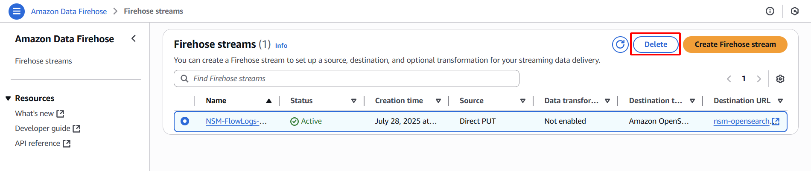

{}
In this final section, you will learn how to properly clean up all the AWS resources provisioned throughout this lab. It is crucial to delete these resources to avoid incurring unnecessary costs and to maintain a tidy AWS account. This step-by-step guide ensures that you systematically remove all components of the network monitoring solution, from Firehose streams and EC2 instances to OpenSearch domains, VPCs, S3 buckets, and IAM roles/policies.
{}

#### Delete Firehose Stream
- Navigate to [https://us-east-1.console.aws.amazon.com/firehose](https://us-east-1.console.aws.amazon.com/firehose)
- Select **NSM-FlowLogs-Firehose** stream
- Click **Delete**    
        
- Type `NSM-FlowLogs-Firehose` and click **Delete**    
    
#### Delete Bastion Hose
- Navigate to [https://us-east-1.console.aws.amazon.com/ec2/home?region=us-east-1#Instances](https://us-east-1.console.aws.amazon.com/ec2/home?region=us-east-1#Instances:)
- Select **NSM-Bastion-Host**
- Click **Instance state → Terminate (delete) instance**    
        
- Click **Terminate (delete)**    
    
#### Delete OpenSearch Domain
- Navigate to [https://us-east-1.console.aws.amazon.com/aos/home?region=us-east-1#opensearch/dashboard](https://us-east-1.console.aws.amazon.com/aos/home?region=us-east-1#opensearch/dashboard)
- Select **nsm-opensearch**    
        
- Click **Delete**    
        
- Type `nsm-opensearch` and click **Delete**    
        
- Waiting for **opensearch domain** to delete successfully    
    
#### Delete VPC
- Navigate to [https://us-east-1.console.aws.amazon.com/vpcconsole/home?region=us-east-1#vpcs:](https://us-east-1.console.aws.amazon.com/vpcconsole/home?region=us-east-1#vpcs:)
- Select **NSM-VPC**
- Click **Actions → Delete VPC**    
        
- Type `delete` and click **Delete**    
    
#### Delete Elastic IP
- Select **Elastic IP** from the left navigation panel
- Select **Elastic IP**
- Click **Actions → Release Elastic IP addresses → Release**    
        
    
#### Delete S3 Bucket
- Navigate to [https://us-east-1.console.aws.amazon.com/s3](https://us-east-1.console.aws.amazon.com/s3)
- Select your bucket (**nsm-flow-logs-YYYYMMDD**) → Click **Empty**    
        
- Type `permanently delete` *→* **Empty**    
        
- Click **Exit**    
        
- Select your bucket again (**nsm-flow-logs-YYYYMMDD**) → Click **Delete**    
        
- Type your bucket name → Click **Delete bucket**    
    
#### Delete IAM Role and IAM Policy
- Navigate to [https://us-east-1.console.aws.amazon.com/iam](https://us-east-1.console.aws.amazon.com/iam/home#/home)
- Select **Role** from the left navigation panel
- Select **NSM-Firehose-Role**
- Click **Delete**    
        
- Type `NSM-Firehose-Role` → Click **Delete**

- Select **Policies** from the left navigation panel
- Search for and select **NSM-Firehose-Policy**
- Click **Delete**

- Type `NSM-Firehose-Policy` **→** Click **Delete**
