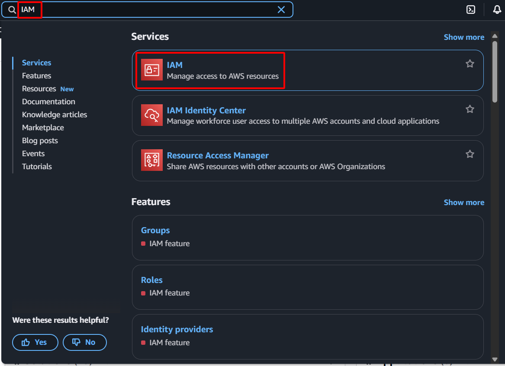

{}
Trong lab này, việc tạo một IAM Policy (**NSM-Firehose-Policy**) và một IAM Role (**NSM-Firehose-Role**) chuyên dụng là rất quan trọng để kích hoạt dịch vụ Kinesis Firehose một cách an toàn nhằm tương tác với các tài nguyên AWS khác như S3 và OpenSearch. Điều này đảm bảo rằng Firehose chỉ có các quyền cần thiết để gửi dữ liệu đến các đích đã định mà không cấp quá nhiều đặc quyền, tuân thủ nguyên tắc quyền tối thiểu, điều cần thiết cho một kiến trúc bảo mật.
{}

#### Tạo IAM Firehose Policy
1. Điều hướng đến **IAM Console**:
    - Điều hướng đến [AWS Management Console](https://aws.amazon.com/console/)
    - Tìm kiếm và chọn **IAM** trong thanh tìm kiếm dịch vụ
    
2. Bắt đầu tạo policy:
    - Điều hướng đến **Policies** trong ngăn điều hướng bên trái
    - Nhấp **Create policy**
    
3. Chỉ định quyền:
    - Chọn tab **JSON**
    - Dán **JSON** sau vào tab **JSON**
        ```json
        {
            "Version": "2012-10-17",
            "Statement": [
                {
                    "Effect": "Allow",
                    "Action": [
                        "s3:AbortMultipartUpload",
                        "s3:GetBucketLocation",
                        "s3:GetObject",
                        "s3:ListBucket",
                        "s3:ListBucketMultipartUploads",
                        "s3:PutObject"
                    ],
                    "Resource": [
                        "arn:aws:s3:::*",
                        "arn:aws:s3:::*/*"
                    ]
                },
                {
                    "Effect": "Allow",
                    "Action": [
                        "es:DescribeDomain",
                        "es:DescribeDomains",
                        "es:DescribeDomainConfig",
                        "es:ESHttpPost",
                        "es:ESHttpPut",
                        "es:ESHttpGet"
                    ],
                    "Resource": [
                        "arn:aws:es:*:*:domain/*"
                    ]
                },
                {
                    "Effect": "Allow",
                    "Action": [
                        "ec2:DescribeVpcs",
                        "ec2:DescribeVpcAttribute",
                        "ec2:DescribeSubnets",
                        "ec2:DescribeSecurityGroups",
                        "ec2:DescribeNetworkInterfaces",
                        "ec2:CreateNetworkInterface",
                        "ec2:CreateNetworkInterfacePermission",
                        "ec2:DeleteNetworkInterface"
                    ],
                    "Resource": "*"
                },
                {
                    "Effect": "Allow",
                    "Action": [
                        "logs:PutLogEvents"
                    ],
                    "Resource": [
                        "arn:aws:logs:*:*:log-group:/aws/kinesisfirehose/*:*"
                    ]
                }
            ]
        }
        ```
    
    - Nhấp **Next**:
    
4. Cấu hình chi tiết policy:
    - **Policy name:** Nhập `NSM-Firehose-Policy`
    
5. Xem lại và tạo
    - Nhấp **Create policy**
    
6. Xác minh việc tạo thành công:
    - Bạn sẽ thấy một thông báo thành công
    - Security group mới của bạn sẽ được thêm vào danh sách
    
#### Tạo IAM Firehose Roles
1. Tạo một role mới:
    - Trong ngăn điều hướng bên trái, chọn **Roles**
    - Nhấp **Create role**
    
2. Chọn thực thể đáng tin cậy:
    - **Trusted entity type:** Chọn **AWS service**
    - **Use case:** Tìm kiếm và chọn `Firehose`
    - Nhấp **Next**
    
3. Thêm quyền:
    - Tìm kiếm và chọn Policy tùy chỉnh của bạn: `NSM-Firehose-Policy`
    - Nhấp **Next**
    
4. Cấu hình chi tiết role:
    - **Role name:** Nhập `NSM-Firehose-Role`
    - **Description:** Nhập `Allows Firehose to deliver data to OpenSearch and S3`
    - Xem lại trust policy và quyền
    
5. Xem lại và tạo:
    - Xác minh tất cả các cấu hình là chính xác
    - Nhấp **Create role**
    
6. Xác nhận việc tạo role:
    - Bạn sẽ thấy một thông báo thành công
    - Role hiện đã sẵn sàng để sử dụng
    