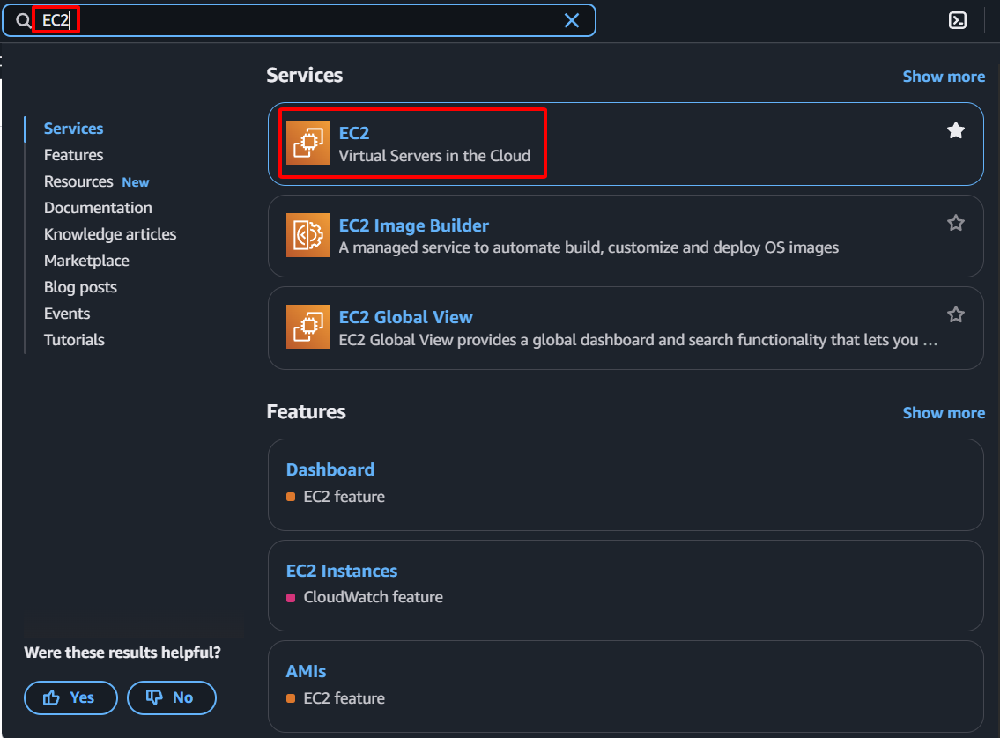

{}
In this step, you will launch an EC2 instance that will serve as your Bastion Host. This host is essential for securely accessing other EC2 instances and resources located in private subnets within your VPC, which do not have direct internet access. Setting up a Bastion Host centralizes access points, enhances security by reducing the attack surface, and provides a controlled entry point for administrative tasks in your private network.
{}

1. Sign in to the [AWS Management Console](https://aws.amazon.com/console/)
    - In the search bar, type **EC2**
    - Select **EC2** from the services list    
        
2. In the EC2 dashboard:
    - Click on **Instances** in the navigation pane
    - Click **Launch instances**    
        
3. Name and Tags
    - **Name:** Enter `NSM-Bastion-Host`    
        
4. Select the Amazon Machine Image (AMI):
    - Under **Quick Start**, select **Amazon Linux**
    - Choose **Amazon Linux 2023** from the available options    
        
5. Choose instance specifications:
    - Choose **t2.micro**
        
6. Create a Key Pair
    - Click **Create new key pair**        
                
    - **Key pair name**: `NSM-Key`
    - **Key pair type**: Select **RSA**
    - **Private key file format:** Select **.pem**
    - Click **Create key pair**
    - **Important**: This file will be downloaded only once. Store it safely    
        
7. Configure Network Settings
    - Click **Edit** in the Network settings section
    - **VPC:** Select your **NSM-VPC**
    - **Subnet:** Select your `NSM-Public-Subnet`
    - **Auto-assign public IP:** Enable
    - **Firewall (security groups):** Select existing security group
    - Choose `SG-Bastion` from the dropdown    
        
8. **Review and Launch**
    - Review your settings
    - Click **Launch instance**
        
9. **Wait for Instance to Initialize**
    - Click **View all instances**
        
    - Wait until the **Instance state** shows "Running" and **Status checks** shows "2/2 checks passed"
    - Note the **Public IPv4 address** of your instance    
    