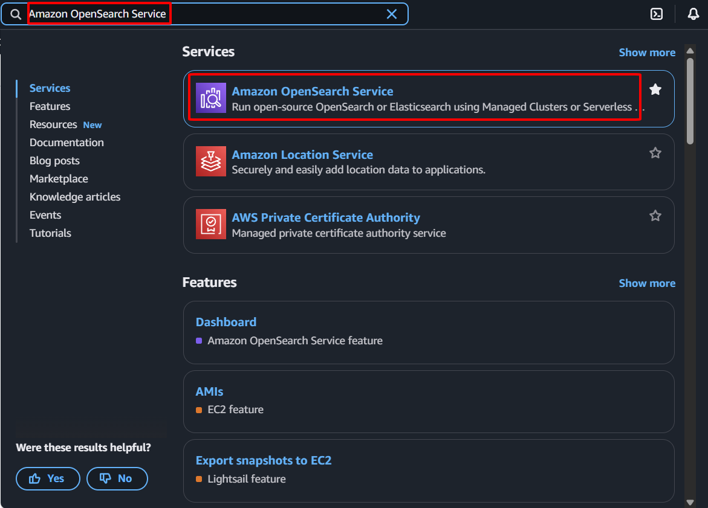

{}
In this step, you will create your Amazon OpenSearch Service domain. This domain will act as the centralized log analytics and search platform for the VPC Flow Logs data collected in this lab. You will configure its instance type, storage, and critically, integrate it within your **NSM-VPC**'s private subnet, ensuring secure access only from within your defined network, thereby enhancing data isolation and security.
{}

1. Sign in to the [AWS Management Console](https://aws.amazon.com/console/)
    - In the search bar, type `Amazon OpenSearch Service`
    - Select **Amazon OpenSearch Service** from the services list    
        
- Click **Create domain** to begin    
        
1. Domain Configuration
    - **Domain name:** Enter `nsm-opensearch`
    - **Domain creation method:** Select **Standard create**
    - **Templates:** Select **Dev/test** (for lab environment)        
                
    - **Deployment option(s):** Select **Domain without standby** (sufficient for lab purposes)
    - **Availability Zone(s):** Select **1-AZ**
    - **Version:** Select the latest OpenSearch version available (e.g., OpenSearch 2.19)        
                
2. Number of data nodes
    - **Instance family:** Select **General purpose** from the dropdown
    - **Instance type:** Select **t3.small.search** (sufficient for lab purposes)
    - **Number of data nodes:** Set to 1 (for lab environment)        
                
    - **Storage type:** Select **EBS**
    - **Volume type:** General Purpose (SSD) - gp3
    - **Storage size per node:** 10 GiB        
                
3. Network Configuration
    - **Network:** Select **VPC access**
    - **IP address type:** Select **IPv4 only**
    - **VPC:** Select your **NSM-VPC** from the dropdown
    - **Subnets:** Select **NSM-Private-Subnet**
    - Sec**urity groups:** Select **SG-OpenSearch**    
        
4. **Fine-grained access control**
    - Uncheck **Enable fine-grained access control**    
        
5. **Access policy:**
    - Select **Configure domain level access policy**
    - Action: Select **Allow**    
        
6. Review and Create
    - Review all settings to ensure they match your requirements
    - Click **Create** to initiate domain creation    
        
    - Wait for the domain status to change to **Active** (this may take 15-20 minutes)    
        
    - Copy **OpenSearch Dashboards URL** (without `https://` and `/_dashboards`)        
                
        