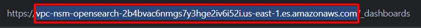

{}
Bước này rất quan trọng để chuẩn bị OpenSearch domain của bạn để đưa vào và phân tích dữ liệu VPC Flow Log một cách chính xác. Bạn sẽ xác minh quyền truy cập vào OpenSearch Dashboards thông qua một đường hầm SSH qua Bastion Host của bạn. Sau đó, bạn sẽ tạo và kiểm tra một ingest pipeline (**vpc-flow-log-pipeline**). Pipeline này sử dụng một bộ xử lý Grok để phân tích cú pháp các thông báo VPC Flow Log thô, không có cấu trúc thành các trường riêng biệt, có thể tìm kiếm được, làm cho dữ liệu trở nên rất có giá trị cho phân tích bảo mật và giám sát mạng trong OpenSearch.
{}

#### Xác minh quyền truy cập vào OpenSearch Dashboards
Bây giờ OpenSearch domain của bạn đã hoạt động, bạn cần xác minh rằng bạn có thể truy cập OpenSearch Dashboards.
1. **Thiết lập Đường hầm SSH để truy cập OpenSearch Dashboards**
    - **Mở một terminal hoặc command prompt trên máy tính cục bộ của bạn**
    - **Tạo một đường hầm SSH qua Bastion Host của bạn**
        ```powershell
        ssh -i "your-key.pem" -L 9200:your-opensearch-endpoint:443 ec2-user@your-bastion-host-ip
        ```
        - Thay thế `your-key.pem` bằng đường dẫn đến tệp khóa của bạn
        - Thay thế `your-opensearch-endpoint` bằng endpoint OpenSearch domain của bạn (không bao gồm `https://` và `/_dashboards`) mà bạn đã sao chép ở bước trước
        
        - Thay thế `your-bastion-host-ip` bằng IP công cộng của Bastion Host của bạn
        
    - Giữ cửa sổ terminal này mở trong khi bạn thực hiện các bước sau

2. **Truy cập OpenSearch Dashboards**
    - Mở trình duyệt web của bạn, nhập URL: `https://localhost:9200/_dashboards/`
    
    
3. **Xác minh quyền truy cập quản trị của bạn**
    - **Khám phá giao diện OpenSearch Dashboards**
        - Sau khi đăng nhập, bạn sẽ thấy trang chủ OpenSearch Dashboards
        - Dành chút thời gian để làm quen với giao diện
    - **Kiểm tra tình trạng Cluster**
        - Trong menu điều hướng bên trái, nhấp vào **Dev Tools**
        
        - Trong Console, chạy lệnh sau:
            ```
            GET _cluster/health
            ```
        - Phản hồi sẽ hiển thị trạng thái sức khỏe của cluster của bạn (lý tưởng là "green")
        
4. Tạo Ingest Pipeline
    Thực hiện lệnh này trong console Dev Tools để tạo pipeline phân tích cú pháp của bạn:
    ```json
    PUT _ingest/pipeline/vpc-flow-log-pipeline
    {
      "description": "Pipeline to parse VPC Flow Log data",
      "processors": [
        {
          "grok": {
            "field": "message",
            "patterns": [
              "%{NUMBER:version:int} %{NUMBER:account_id} (%{NOTSPACE:interface_id}|-) (%{IP:srcaddr}|-) (%{IP:dstaddr}|-) (%{NUMBER:srcport:int}|-) (%{NUMBER:dstport:int}|-) (%{NUMBER:protocol:int}|-) (%{NUMBER:packets:int}|-) (%{NUMBER:bytes:long}|-) (%{NUMBER:start:long}|-) (%{NUMBER:end:long}|-) (%{WORD:action}|-) (%{WORD:log_status}|-)"
            ]
          }
        },
        {
          "script": {
            "description": "Convert dash values to null",
            "source": """
            def fields = ['interface_id', 'srcaddr', 'dstaddr', 'srcport', 'dstport', 'protocol', 'packets', 'bytes', 'start', 'end', 'action', 'log_status'];
            for (def field : fields) {
              if (ctx.containsKey(field) && ctx[field] == '-') {
                ctx[field] = null;
              }
            }
            """
          }
        },
        {
          "remove": {
            "field": "message"
          }
        }
      ]
    }
    ```
    Pipeline này:
    - Sử dụng một **Grok processor** để phân tích cú pháp định dạng VPC Flow Log được phân tách bằng dấu cách
    - Trích xuất 14 trường riêng lẻ với các kiểu dữ liệu phù hợp
    - Xóa trường **message** gốc sau khi phân tích cú pháp
    
5. Kiểm tra Pipeline
    Trước khi áp dụng nó cho dữ liệu của bạn, hãy kiểm tra pipeline với dữ liệu mẫu của bạn:
    ```json
    POST _ingest/pipeline/vpc-flow-log-pipeline/_simulate
    {
      "docs": [
        {
          "_source": {
            "message": "2 509069525939 eni-06dbfc5864eff22c5 10.0.2.79 10.0.2.216 443 56618 6 4 4734 1753442090 1753442117 ACCEPT OK"
          }
        }
      ]
    }
    ```
    Phản hồi sẽ hiển thị dữ liệu của bạn được phân tích thành các trường riêng lẻ:
    
6. Áp dụng Pipeline cho Dữ liệu mới
    Đối với **dữ liệu mới đến**, hãy tạo một index template tự động áp dụng pipeline:
    ```json
    PUT _index_template/vpc-flow-logs-template
    {
      "index_patterns": ["vpc-flow-logs-*"],
      "template": {
        "settings": {
          "default_pipeline": "vpc-flow-log-pipeline"
        },
        "mappings": {
          "properties": {
            "version": { "type": "keyword" },
            "account_id": { "type": "keyword" },
            "interface_id": { "type": "keyword" },
            "srcaddr": { "type": "ip" },
            "dstaddr": { "type": "ip" },
            "srcport": { "type": "integer" },
            "dstport": { "type": "integer" },
            "protocol": { "type": "integer" },
            "packets": { "type": "integer" },
            "bytes": { "type": "long" },
            "start": { "type": "date", "format": "epoch_second" },
            "end": { "type": "date", "format": "epoch_second" },
            "action": { "type": "keyword" },
            "log_status": { "type": "keyword" }
          }
        }
      }
    }
    ```
    
- Giữ cửa sổ này mở trong khi bạn thực hiện các bước tiếp theo