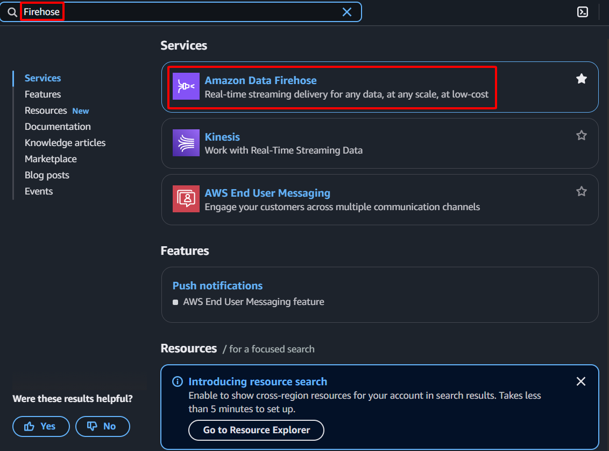

{}
In this section, you will create and configure an Amazon Kinesis Data Firehose delivery stream. This Firehose stream is a critical component that will automatically capture, transform, and load your VPC Flow Logs data from a direct PUT source into your Amazon OpenSearch Service domain and also back up the data to your S3 bucket. Firehose simplifies the process of reliably streaming data to various destinations, ensuring your network telemetry is efficiently collected and made available for analysis.
{}

#### Creating a Kinesis Data Firehose Delivery Stream
1. Sign in to the [AWS Management Console](https://aws.amazon.com/console/)
    - In the search bar, type `Firehose`
    - Select **Amazon Data Firehose** from the services list    
        
2. Create Firehose stream
    - Select **Firehose streams** from the left navigation pane
    - Click **Create Firehose stream**    
        
3. Choose source and destination
    - **Source:** Select **Direct PUT**
    - **Destination:** Select **Amazon OpenSearch Service**    
        
4. **Firehose stream name:** Enter `NSM-FlowLogs-Firehose`    
        
5. Configure Destination Settings
    - **OpenSearch Service domain:**
        - Click **Browse**            
                        
        - Select **nsm-opensearch** and click **Choose**            
                        
    - **Index:** Enter `vpc-flow-logs`
    - **Index rotation:** Select **Every day**        
                
6. **Destination VPC connectivity**
    - **VPC:** `NSM-VPC`
    - **Subnets:** `NSM-Private-Subnet`
    - **Security groups:** Select `SG-Firehose`        
                
7. Backup settings
    - **Source record backup in Amazon S3:** Select **All data**
    - **S3 backup bucket:**
        - Click **Browse**            
                        
        - Choose your S3 Bucket (`nsm-flow-logs-YYYYMMDD`) and click **Choose**            
                        
    - **S3 prefix**        
        ```
        flow-logs/year=!{timestamp:yyyy}/month=!{timestamp:MM}/day=!{timestamp:dd}/hour=!{timestamp:HH}/
        ```        
    - **S3 error output prefix:** `errors/`    
        
8. Advanced Settings
    - **Service access**
        - Select **Choose existing IAM role**
        - Select **NSM-Firehose-Role** from the dropdown    
        
9. Create
    - Click **Create delivery stream** at the bottom of the page
    - Wait for the delivery stream status to change to **Active**    
        
    