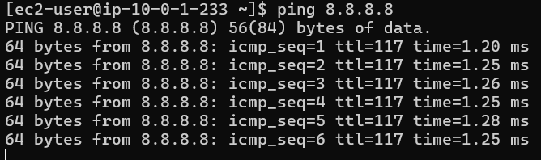

{}
In this step, you will verify that VPC Flow Logs are being successfully collected and delivered to Amazon OpenSearch Service via Kinesis Data Firehose. Checking this data flow is essential to ensure that your entire network monitoring pipeline is operating as expected, providing real-time network data for subsequent analysis and visualization.
{}

#### Verify Data Ingestion in OpenSearch Dashboards
1. Generate Network Traffic for Testing
    Before verifying the data flow, ensure you have some network traffic to analyze:    
    - SSH into your Bastion Host using your key pair
    - From the Bastion Host, try connecting to other resources in your VPC
    - Run some basic network commands like `ping`, `curl`, or `wget`        
                
    - Wait about 5 - 10 minutes

2. Verify Kinesis Data Firehose Delivery
    - Navigate to the [**Amazon Kinesis console**](https://us-east-1.console.aws.amazon.com/firehose)
    - Select your **NSM-FlowLogs-Firehose** stream        
                
    - Click on the **Monitoring** tab        
                
    - Look for:
        - **Incoming records** (should be greater than 0)
        - **Incoming bytes** (should be greater than 0)
        - **S3 delivery success** (should match incoming records)
        - **OpenSearch delivery success** (should match incoming records)        
                
3. Check for Errors
    - Look for any error logs:
        - **Destination error logs**
        - **Backup error logs**
    - If you see errors, check the CloudWatch logs for your Firehose stream        
                
4. Verify S3 Bucket Delivery
    - Navigate to [the AWS S3 Console](https://us-east-1.console.aws.amazon.com/s3)
    - Click on your S3 bucket name        
                
    - Navigate through the prefix structure you configured (e.g., `flow-logs/year=2025/month=07/day=22/hour=17/`)
    - You should see files with timestamps corresponding to when your flow logs were generated        
        
5. Verify OpenSearch Service Delivery
    - Return to: `https://localhost:9200/_dashboards/`
    - In **Dev Tools**
    - Run the following command to list all indices:        
        ```
        GET _cat/indices?v
        ```        
    - Look for indices that match your configured index pattern (e.g., `vpc-flow-logs`)
    - Verify that the index has documents (the **docs.count** column should be greater than 0)    
    