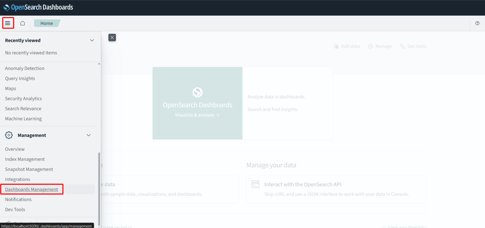

{}
Trong bước này, bạn sẽ tạo một bảng điều khiển trong OpenSearch Dashboards để trực quan hóa dữ liệu VPC Flow Logs của mình. Xây dựng một bảng điều khiển giúp bạn dễ dàng giám sát và phân tích các mẫu lưu lượng mạng, xác định các bất thường và có được những hiểu biết sâu sắc hơn về hoạt động mạng của VPC thông qua các biểu đồ và số liệu thống kê trực quan.
{}

#### Tạo Trực quan hóa và Dashboard
1. **Tạo Mẫu chỉ mục mới**
    - Trong thanh bên trái, nhấp vào **Dashboards Management**
    
    - Nhấp vào **Index patterns**
    - Nhấp **Create index pattern**
    
    - **Index pattern name:** Nhập `vpc-flow-logs*`
    - Nhấp **Next step**
    
    - **Time field:** Chọn **start**
    - Nhấp **Create index pattern**
    
    
2. **Tạo Biểu đồ tròn cho Lưu lượng truy cập theo IP nguồn**
    - Trong thanh bên trái, nhấp vào **Visualize**
    
    - Nhấp **Create visualization**
    
    - Chọn **Pie** làm loại trực quan hóa
    
    - Chọn mẫu chỉ mục của bạn
    
    - Dưới **Buckets**, nhấp **Add →** **Split slices**
    
    - **Aggregation:** Chọn **Terms**
    - **Field:** Chọn **srcaddr** (địa chỉ IP nguồn)
    - **Size:** 10
    - Nhấp **Update** để xem trực quan hóa
    
    - Nhấp **Save** và đặt tên là `Top Source IPs`
    
    
3. **Tạo Biểu đồ cột cho Lưu lượng truy cập theo Cổng đích**
    - Quay lại **Visualizations List**
    
    - Nhấp **Create visualization**
    
    - Chọn **Vertical bar** làm loại trực quan hóa
    
    - Chọn mẫu chỉ mục của bạn
    
    - Dưới **Buckets**, nhấp **Add** → **X-axis**
    
    - **Aggregation:** Chọn **Terms**
    - **Field:** Chọn **dstport** (cổng đích)
    - **Size:** 10 (top 10 cổng đích)
    - Nhấp **Update** để xem trực quan hóa
    
    - Nhấp **Save** và đặt tên là `Top Destination Ports`
    
    
4. **Tạo Biểu đồ đường cho Lưu lượng truy cập theo thời gian**
    - Quay lại **Visualizations List**
    
    - Nhấp **Create visualization**
    
    - Chọn **Line** làm loại trực quan hóa
    
    - Chọn mẫu chỉ mục của bạn
    
    - Dưới **Buckets**, nhấp **Add → X-axis**
    
    - **Aggregation:** Chọn **Date Histogram**
    - **Field:** Chọn **start**
    - **Interval:** Chọn **Auto**
    - Nhấp **Update** để xem trực quan hóa
    
    - Nhấp **Save** và đặt tên là `Traffic Over Time`
    
    
5. **Tạo Dashboard mới**
    - Trong thanh bên trái, nhấp vào **Dashboard**
    
    - Nhấp **Create new dashboard**
    
    - Nhấp **Add** ở góc trên bên phải
    
    - Chọn tất cả các trực quan hóa bạn đã tạo:
        - **Top Source IPs**
        - **Top Destination Ports**
        - **Traffic Over Time**
    
    - Sắp xếp các trực quan hóa bằng cách kéo và thay đổi kích thước chúng
- Nhấp **Save** ở góc trên bên phải
    
- Đặt tên là `VPC Flow Logs Dashboard`
    